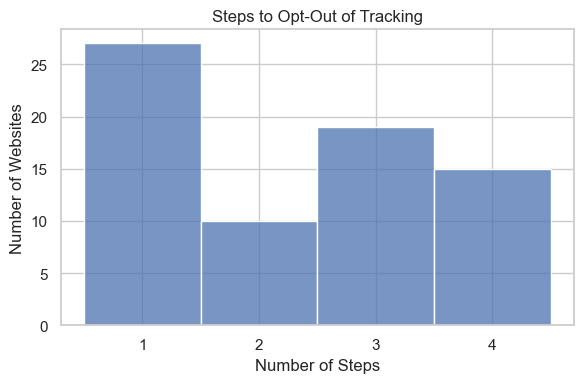
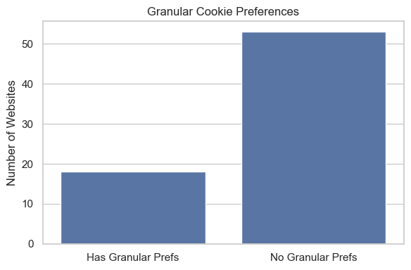
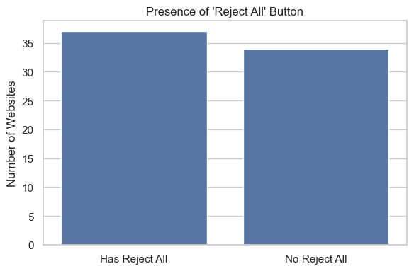

# 🍪 Cookie Banner Compliance Analysis

This mini-dashboard provides a visual summary of how websites handle cookie consent banners, based on data collected via the **Agent Papaya** Chrome extension.

We analyzed cookie banners from dozens of websites to evaluate their compliance with GDPR and CCPA, as well as UX design patterns that can influence user consent.

---

## 📊 Visualizations

### 1. Steps to Opt-Out

This chart shows how many steps a user must take to reject tracking cookies:

- **1 Step**: Clear "Reject All" button on the banner
- **2 Steps**: Requires clicking "Manage Preferences" → then "Reject All"
- **3 Steps**: "Manage" present but no reject option inside
- **4 Steps**: Inferred from banners with layered or deceptive flows

---

### 2. Granular Preferences Offered

Breakdown of how many websites let users customize preferences (e.g., marketing vs performance cookies). Lack of granularity violates GDPR guidelines.

---

### 3. Presence of a "Reject All" Button

Just under half the websites fail to offer any clear "Reject All" option at all, making them non-compliant under GDPR and CCPA.

---

## 🧠 Data Source

Collected using the Agent Papaya Chrome extension, which uses in-browser AI and DOM inspection to scan cookie banners. Some data was augmented with GPT-4o and manually validated.

---

## 🙋 Why This Matters

Cookie banners are supposed to give users **genuine control** over their data. But many are designed to **manipulate consent**, exploiting users through:

- Dark patterns
- Hidden or misleading buttons
- Complex opt-out processes

We believe in transparent consent and user empowerment.

---

## 🔍 Coming Soon

- Shadow DOM support (for hidden cookie banners)
- GPC compliance check (Global Privacy Control)
- Manual verification tags and audit scores

---

📬 Want to collaborate or report a banner?  
Email [team@papayaverse.com](mailto:team@papayaverse.com)
